# CS 6460: Artificial Intelligence

# Introduction

Instructor: George Rudolph

Utah Valley University Spring 2026

\(slides adapted from Dan Klein\,   Pieter Abbeel\, Anca Dragan\, et al\)

---
<!-- slide 2 -->

# Sci-Fi AI?

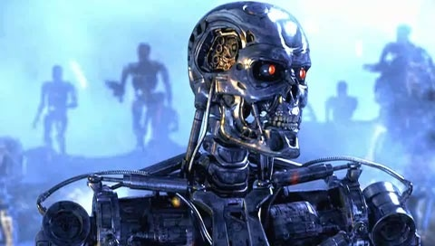

---

<!-- slide 3 -->

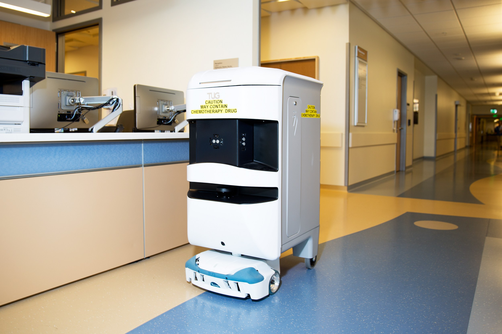

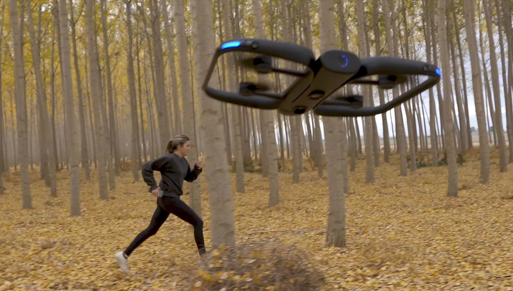

---

# Learning Outcomes

1. What is artificial intelligence?

2. What can AI do?

3. What is this course?

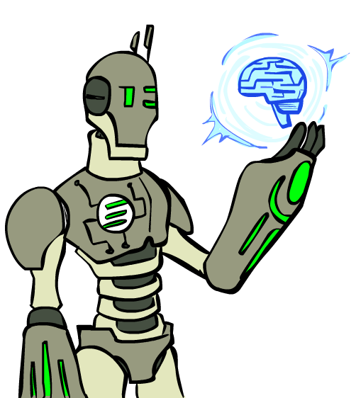

---

# What is AI?

The science of making machines that:
- Think like people
- Think rationally

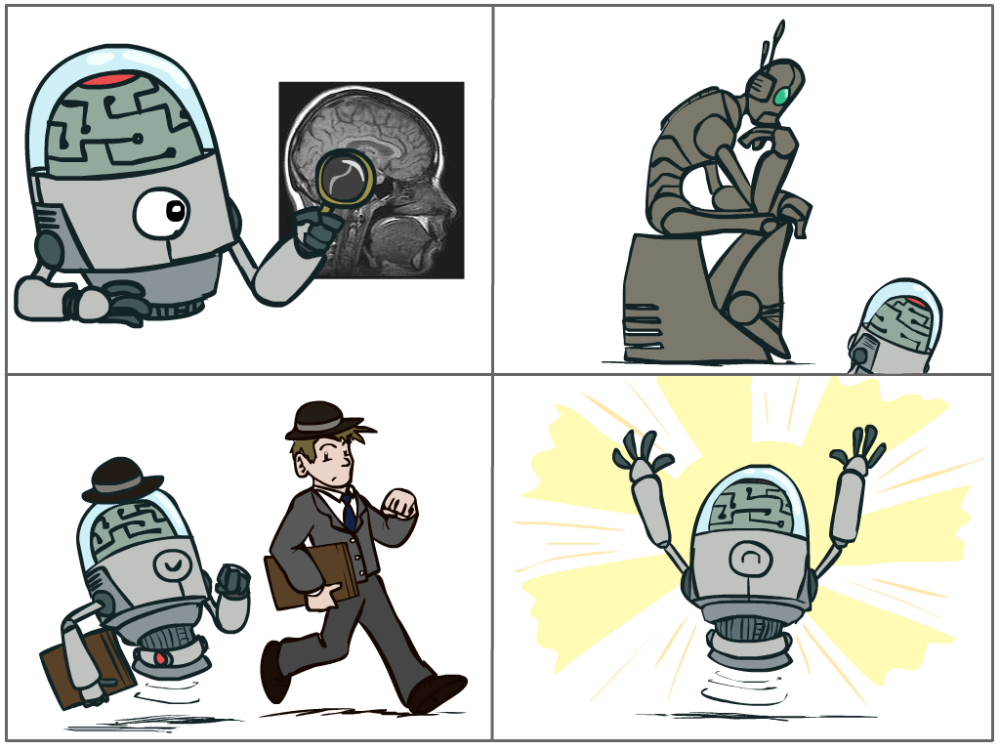

---

# Rational Decisions

* We’ll use the term  __rational__  in a very specific\, technical way:
  * Rational: maximally achieving pre\-defined goals
  * __Rationality__ only concerns what decisions are made
      - not the thought process behind them
  * Goals are expressed in terms of the  __utility__  of outcomes
  *  Being rational means    __maximizing your expected utility__ 

A better title for  this course   might  be:

Computational Rationality or 
Rational Agents 

---

# Maximize Your Expected Utility

---

# Expected Utility

Consequences of an action, context, other actors expressed as a weighted average of the utilities of all possible outcomes.

Goal: **Maximize** expected utility as a convex optimization problem

---

# Related to

- Utilitarianism (Consequntialism) – Jeremy Bentham

- Utility rather than values, could be Virtue Ethics – Aristotle

- Deontology (Duty based ethics)

---

# Self-interest

- What is an agent that is good about acting for itself? Humans! 

- Replicating the brain would be an AI, right?

---

# What About the Brain?

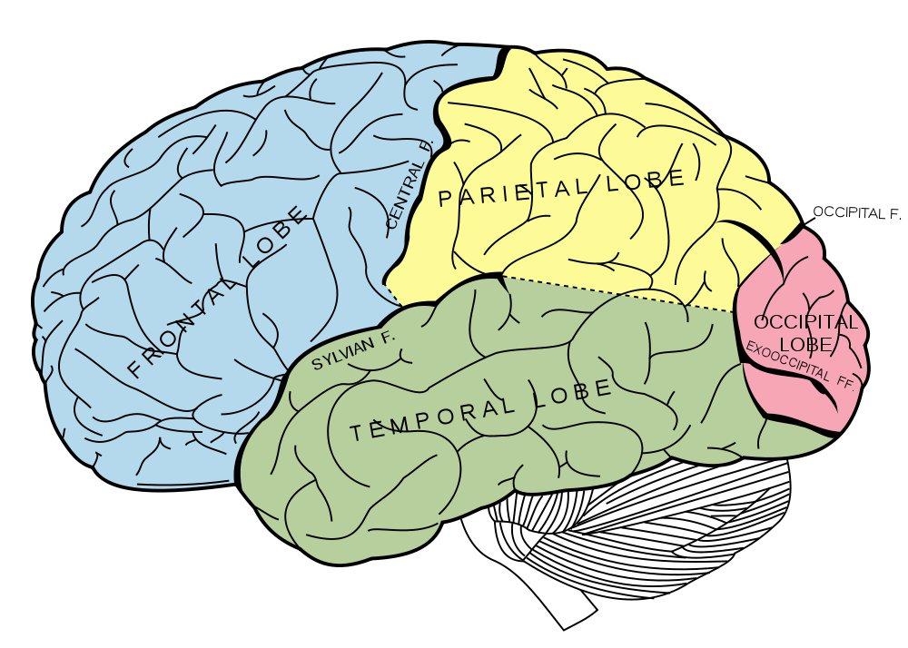

_Brains \(human minds\) are very good at making rational decisions\, but not perfect_

_Brains aren't as modular as software\, so hard to reverse engineer\!_

_"Brains are to intelligence as wings are to flight"_

_Lessons learned from the brain: memory \(data\) and simulation \(computation\) are key to decision making_

---
# Course Topics 

* Part I: Making Decisions
  * Fast search / planning
  * Heuristic and Adversarial search
* Part II: Reasoning under Uncertainty
  * Bayesian Networks
  * Markov Decision Processes
  * Reinforcement Learning

* Part III
  * Independent Study
* Throughout: Applications
  * Natural language\, vision\, robotics\, games\, …

---

# What's Novel in Modern AI?

* Deep Learning (CNNs, Transformers) has revolutionized many AI applications
* Historically feature engineering was done by hand
* Even today for most projects 80% of effort is in data preparation
* Generative AI has transformed AI capabilities
  * Generative Adversarial Networks (GANs) for realistic image generation
  * Diffusion models (DALL-E, Stable Diffusion) for high-quality image synthesis
  * Large Language Models (LLMs) for text generation and understanding
  * Foundation models trained on massive data can be adapted to many tasks
* An AI may learn the utility function along with the data
  * Function to optimize may not be known beforehand

---

# Logistics

---

# Canvas

* Syllabus
* Course schedule
* Slides and notes
* Homework
* Exams
* Grades

---

# GitHub

* Copy starting Code for Projects from zip file in Canvas
* Put in own private GitHub Repository
  * Must be private\, NOT public
* Add your instructor as a collaborator on your copy
  * Clone the repo to your local machine
* Create a new branch in your copy for each project (search, multiagent, reinforcement, tracking, <independent study>)
* Commit changes for your solution in the respective branch
  * Push to your remote repository
* Don't ask me to use pull requests on branches--it's an extra step I don't need

---

# Communicate

* Email or Teams messages
* Teams video conference with instructor
* Canvas Discussion posts related to topics
  * Post as\-needed
  * Burning question that you want answers to
  * Muddiest Point that you want clarification on
  * Can come from readings\, slides\, projects\, other sources

* Topic Hour: Propose 4pm Tuesday; join if available

---

# Grading Projects

* Find project descriptions and starting code from GitHub
* Submit Sumit a link to your repo/branch in Canvas
* 4 projects have an autograding script  autograder\.py
  * Objective standard
  * Incremental development of projects
  * You know how you’re doing
  * Faster feedback cycle
* Independent Study project is manually graded
  * cannot submit after last day of class
---

# Class Instruction

* This course is independent study on AI
* Well\-defined
  * Schedule
  * Set of readings
  * Homework
  * Exams
  * Programming projects to complete
* Very limited instruction and faculty supervision
* Requires individual initiative and responsibility
* Is not self\-paced
  * Assignments have expected due dates

---

# Helpful Prerequisites

* Admitted to a graduate program \(you are\)
* Some basic Python programming experience
* Familiar with
  * Basic data structures and algorithms like searching and sorting
  * Basic probability and statistics
  * Some calculus is helpful but not required

---

# Direct Instruction

* No direct instruction
* Office Hours \(on Teams\, or  in\-person\)
  * Posted
* Project Parties??? \(next slide\)

---

# Project Parties???

* Collaborate with another student on projects 1\-4 if you want
  * But you must write your own code\, not copy each other’s code
* Independent Study project can be a group of 2 project
  * Single submission for the whole group
  * Individual grading
  * 30% peer grading \(from the group\) \+ 70% instructor grade
  * Must get instructor approval of topic from instructor
* Get together online or in person before each deadline
* Can get guidance from the instructor

---

# Homework

* 4 Homeworks
* Individual work
* Engage with material differently than coding projects
* Preparation for mid\-term and final exams

---

# Projects

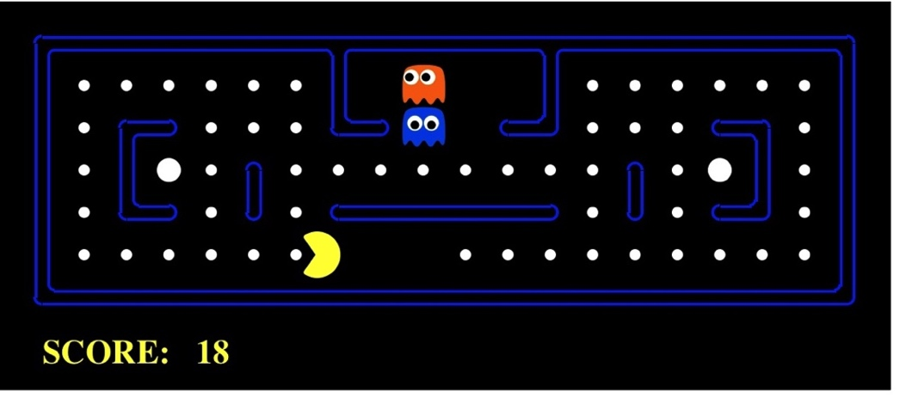

* See Canvas for Due Dates
* See zip file for starting code to put in your repo
* Python 3\.13 or compatible
* Autograded
*  __Projects give you hands\-on experience with the algorithms__ 
*  __Not just theory__ 

---

# Late Policy

* Late penalty is 10% per day up to 5 business days
  * No submission after 5 business days
* Exams and independent study project may not be submitted late
* Instructor may grant exceptions or extensions
  * Case\-by\-case basis
    * Ask ASAP if you feel you need one
  * Example: health or medical reasons or an emergency
* Sometimes you figure something out on a later project that builds on an earlier project
  * you may be allowed to resubmit the earlier project for improved score
  * Check with your instructor if this happens

---

# Assessments

- Midterm Exam

- Final Exam

## Exams

In Canvas \(see for dates\)

Multiple Choice, Some short answer

Not Necessarily Easy

Available for 2\-3 days each

Open Book? Harder Questions

Already stressed about the exams? Prepare good notes

---

# Instruction vs. Assessment

__Assessment__

Measure knowledge\, skill

Each student on their ownMay not successfully complete

__Instruction__

Grow knowledge

Collaborate\, work until success

* These  two goals don’t mix
* Lecture material/ Videos / Discussion / Projects are instruction
  * Usually collaborative\, work until success \(but please no spoilers\)
* Exams are assessment
  * on your own \(harder\)

---

# Grade Breakdown

Homework \(20%\)

Projects \(50%\)

Midterm \+ Final \(30%\)

---

# Student Wellness

* UVU CS courses are rigorous and mentally demanding
* Overwhelmed by the course? Contact your instructor or Student Support Services\.
* If you need professional help\, contact Student Health Services

---

# Academic Honesty

* No consultation or collaborators for Exams
  * Including the Internet\, Gen AI
* Acknowledge all collaborators and sources on projects
* Copying  someone else’s code  and submitting it as your own is
  * asking for a grade you did not earn and
  * claiming mastery of skills of which you have not demonstrated mastery
  * Gen AI can be used as an aid\, but not a crutch or a replacement

---

# Required Textbook

Russell & Norvig\, AI: A Modern Approach\, 4th Ed\.

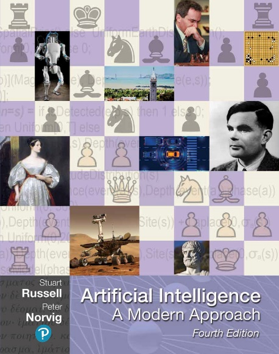

---

# A (Short) History of AI

**1940s—1950s: Foundations**
* 1943: McCulloch & Pitts
* 1950: Turing
* 1956: Dartmouth

**1960s—1980s**
* Game programs
* Expert systems → Winter

**1990s—2011**
* ML, probabilistic
* Bayesian methods

**2012—2024: Deep Learning & Gen AI**
* **2012**: ImageNet
* **2014**: GANs
* **2016**: AlphaGo
* **2017**: Transformers
* **2018**: BERT
* **2019**: GPT-2
* **2020**: GPT-3
* **2021**: DALL-E
* **2022**: ChatGPT
* **2023**: GPT-4
* **2024**: Agentic AI

---

# What Can AI Do Today?

**Quiz: Which can be done? (2024)**

* ✅ Play Jeopardy?
* ✅ Win chess vs. humans?
* ✅ Win Go vs. best?
* ✅ Play table tennis?
* ⚠️ Grab cup, put on shelf?
* ❌ Unload dishwasher?
* ⚠️ Drive on highway?
* ❌ Drive city streets?
* ✅ Buy groceries online?
* ⚠️ Buy groceries in store?
* ✅ Prove math theorem?
* ⚠️ Perform surgery?
* ⚠️ Unload dishwasher (with person)?
* ✅ Translate (real-time)?
* ✅ Write funny story?

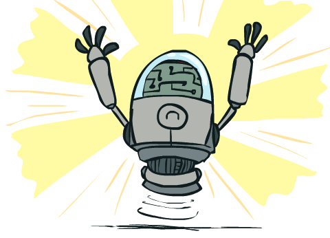

---

# AI Story Generation: Then and Now

**1984: Tale-Spin**
* "Joe Bear ate beehive" — wrong
* "Gravity drowned" — error
* Missing context

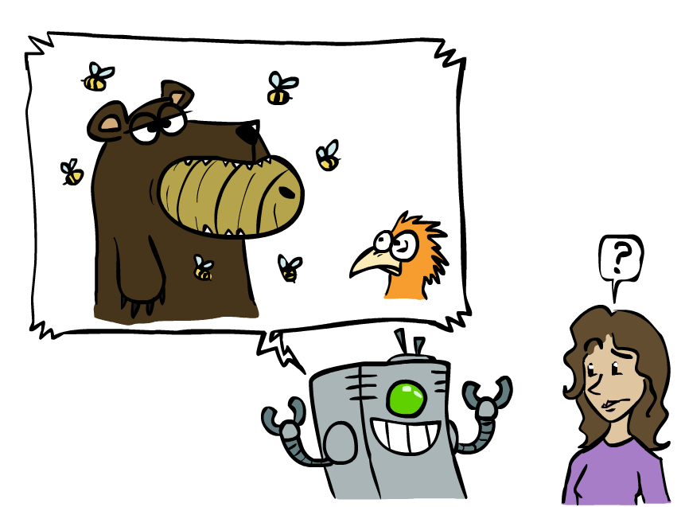

**2024: Modern LLMs**
* ✅ Coherent narratives
* ✅ Context awareness
* ⚠️ Factual errors
* ⚠️ Hallucinations
* ⚠️ Consistency issues

**Key:** Improved but reasoning challenges remain

---

# Natural Language & Large Language Models

* **Speech Technologies**
  * Voice assistants (Siri, Alexa)
  * Real-time transcription
  * Natural text-to-speech

* **LLMs (2024)**
  * GPT-4, Claude 3, Gemini
  * Code generation (Copilot)
  * Translation, Q&A
  * Multimodal capabilities

* **Applications**
  * Content creation
  * Code assistance
  * Chatbots
  * Research synthesis

* **Challenges:** Hallucinations, bias, deepfakes, privacy

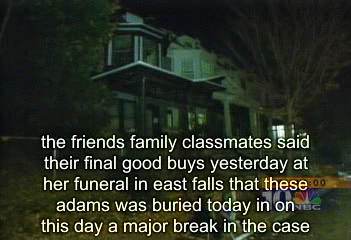

---

# Computer Vision (2024)

* **Capabilities**
  * Object detection (YOLO, DETR)
  * Segmentation (SAM)
  * Image generation (DALL-E 3, Midjourney)
  * Medical imaging, AV perception

* **Multimodal AI**
  * Vision-language (GPT-4V)
  * Image-text conversion
  * Video understanding

* **Applications**
  * Medical diagnosis, Manufacturing QC
  * Security, AR/VR

---

# Game Agents & AI in Games

* **Milestones**
  * 1997: Deep Blue (Chess)
  * 2016: AlphaGo (Go)
  * 2017: AlphaZero
  * 2019: MuZero

* **Current (2024)**
  * Game NPCs/opponents
  * Strategy game AI
  * General game-playing

* **Key Insight**
  * Specialized → general
  * Self-learning
  * Transfer learning

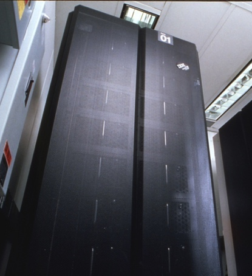

---

**AlphaGo vs. Lee Sedol (2016)**

Historic moment: AI defeated world Go champion

**Key:** Specialized → general-purpose learning

---

# Reinforcement Learning Game Agents

Pixels as the perception! Way harder. Way more games, but fun
What can using pixels in the real world (cameras) give us?

---

# Robotics (2024)

* **Applications**
  * Warehouse, manufacturing
  * Service (hospitals, hotels)
  * Agricultural, delivery

* **Advanced**
  * Boston Dynamics (Atlas, Spot)
  * Humanoid (Tesla Optimus, Figure AI)
  * Surgical (da Vinci), Drones

* **Challenges**
  * Real-world vs. simulation
  * Safety, reliability, cost
  * Human-robot collaboration

* **In this class:** AI planning/control, not mechanical

---

# Robot Learning (2024)

* **Current Research Focus**
  * End-to-end learning from demonstration
  * Sim-to-real transfer learning
  * Multi-task learning for robots
  * Foundation models for robotics

* **Key Advances**
  * Visual learning for manipulation
  * Imitation learning and reinforcement learning
  * Human-robot collaboration
  * General-purpose robot manipulation

* **Challenges**
  * Real-world deployment reliability
  * Safety in human environments
  * Generalization across tasks

---

# Autonomous Vehicles (2024)

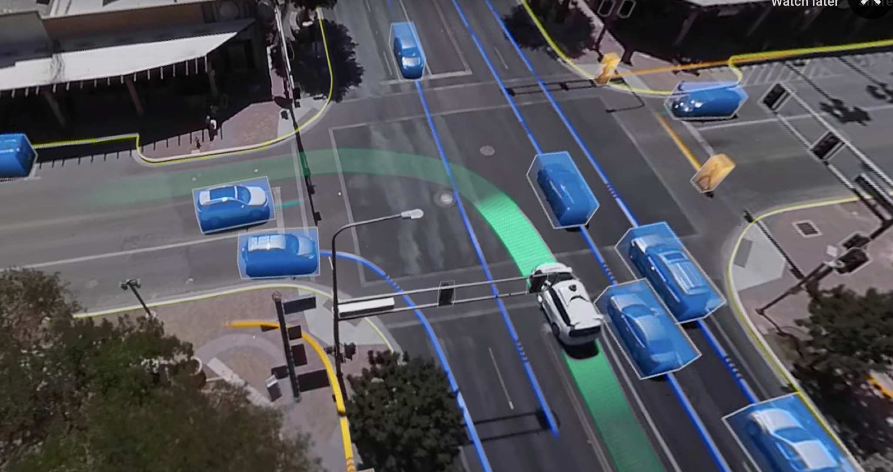

---

# Current State of Self-Driving Cars

* **Deployed (Limited)**
  * Waymo: Phoenix, San Francisco (fully autonomous)
  * Cruise: San Francisco (suspended 2024)
  * Tesla: Full Self-Driving (supervised, Level 2)

* **Why It's So Hard:**
  * Continuous decision-making
  * Multi-agent environment
  * Partially observable (can't see everything)
  * Safety-critical (zero tolerance for errors)
  * Edge cases and rare scenarios

* **Key Challenges:**
  * Weather conditions
  * Unpredictable human behavior
  * Regulatory and liability issues
  * Public trust and acceptance

---

# Why Autonomous Driving is Challenging

**The Problem: Static vs. Dynamic**

* **Snapshot view:** Car appears to have space
* **Reality:** Everything is moving
* **When car accelerates:** Space disappears quickly
* **Need:** Predict future states, not just current

**Key Challenges:**

* **Temporal reasoning:** What will happen next?
* **Multi-agent:** Other cars, pedestrians moving
* **Uncertainty:** Can't predict all behaviors
* **Safety-critical:** Must be right 100% of time

**Example:** Static view shows space, but dynamic reality requires predicting movement

---

# Autonomous Driving: Complex Scenarios

**Real-World Complexity:**

* **Highway:** Relatively easier
* **City streets:** Much harder
  * Multiple agents at intersections
  * Pedestrians, cyclists
  * Construction, weather
  * Edge cases (emergency vehicles, animals)

* **Requires:**
  * Agility and awareness
  * Real-time decision making
  * Handling uncertainty
  * Safety guarantees

---

**Progress in Autonomous Vehicles (2024):**

* Waymo: millions of autonomous miles
* Tesla FSD Beta: hundreds of thousands of users
* Robotaxis in select cities

**Key Question: What is the utility function of a self-driving car?**

---

# Utility Functions in AI

## Clear Utility Function

**Games:**
* Win the game
* Maximize score
* Clear, measurable objectives

## Complex Utility Function

**Real-World Applications:**
* Safety vs. efficiency trade-offs
* Ethical dilemmas (trolley problem)
* Multiple stakeholders' interests
* Long-term vs. short-term goals

---

# Challenges with Utility Functions

* Even in games, clear utility doesn't always give desired behavior
* In robotics, optimizing single metrics can lead to unintended consequences
  * Example: Quadrotor optimizing flight time → rockets straight up
  * Need to consider safety, smoothness, energy efficiency
* Real-world applications require multi-objective optimization

---

# Designing Rational Agents

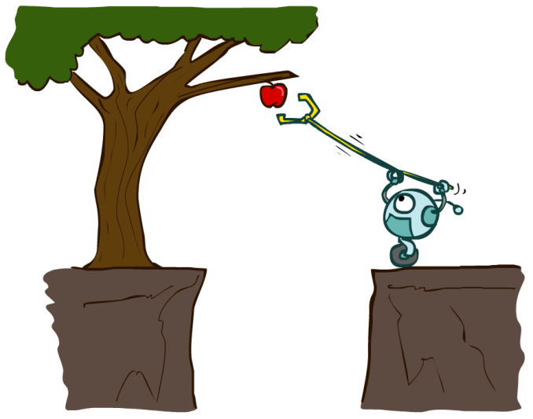

* An  __agent__  is an entity that  _perceives_  and  _acts_ \.
* A  __rational agent__  _ _ selects actions that maximize its \(expected\)  __utility__ \.
* Characteristics of the  __percepts\, environment\,__  and  __action space __ dictate techniques for selecting rational actions
*  __This course __   is about:
  * General AI techniques for a variety of problem types
  * Learning to recognize when and how a new problem can be solved with an existing technique
---

Quick recap: what will we do in this class?

---

# Pac-Man as an Agent

Pac\-Man is a registered trademark of Namco\-Bandai Games\, used here for educational purposes

---

# Pac man! 

- How many of you have played this game? 
- It’s surprisingly hard, but you’ll solve it in this class!

---

# Maximize  Your Expected Utility

