<style scoped>
section {
  padding-top: 20px;
  padding-bottom: 10px;
}
h1 {
  margin-top: 8px;
  margin-bottom: 5px;
  line-height: 1.1;
}
h1:first-of-type {
  margin-top: 0;
}
.text-small {
  font-size: 18px !important;
  line-height: 1.2 !important;
  margin-top: 10px;
  margin-bottom: 8px;
}
.text-small p {
  font-size: 18px !important;
  line-height: 1.2 !important;
  margin: 4px 0;
}
img {
  margin: 8px 0;
}
</style>

<center>

# CS 6460: Artificial Intelligence

# Search

<div class = "text-small">

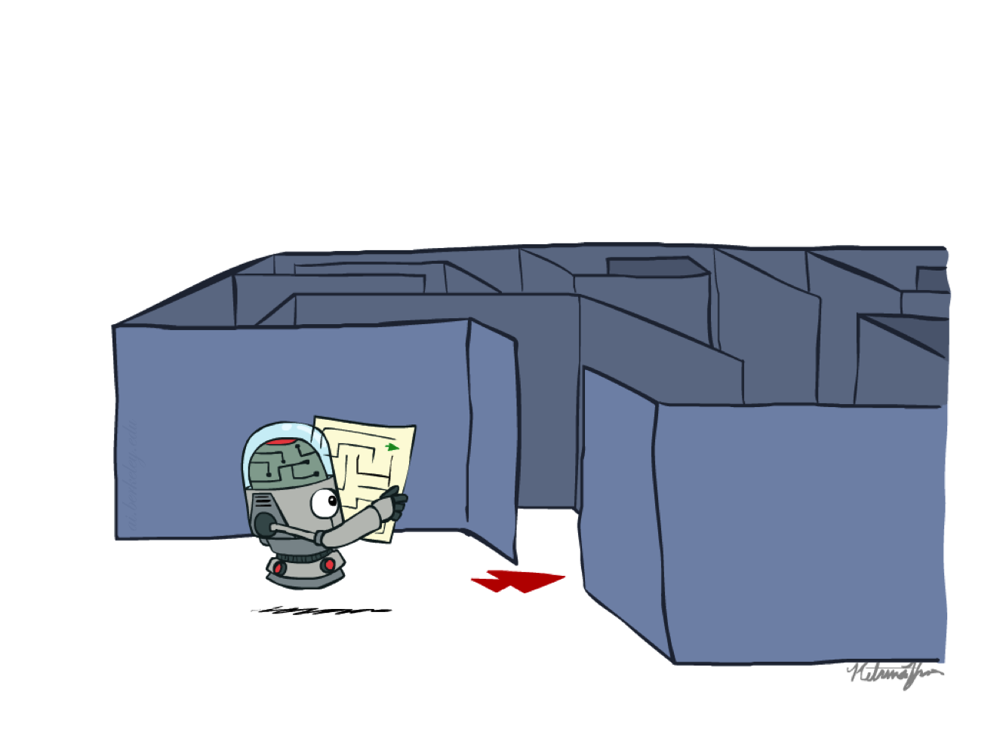

Instructor: George Rudolph

Utah Valley University Spring 2026

</div>

<div class="text-tiny">

slides adapted from Dan Klein and Pieter Abbeel of UC Berkley
see also ai.berkley.edu

</div>

</center>

---

# Learning Outcomes

<div class = "two-column">

<div>

1. Define Agents that Plan Ahead
1. Frame Problems as Search Problems
1. Implement Uninformed Search Algorithms
  * Depth\-First Search
  * Breadth\-First Search
  * Uniform\-Cost Search
1. Analyze Uninformed Search Algorithms using Big\-O complexity

</div>

<div>

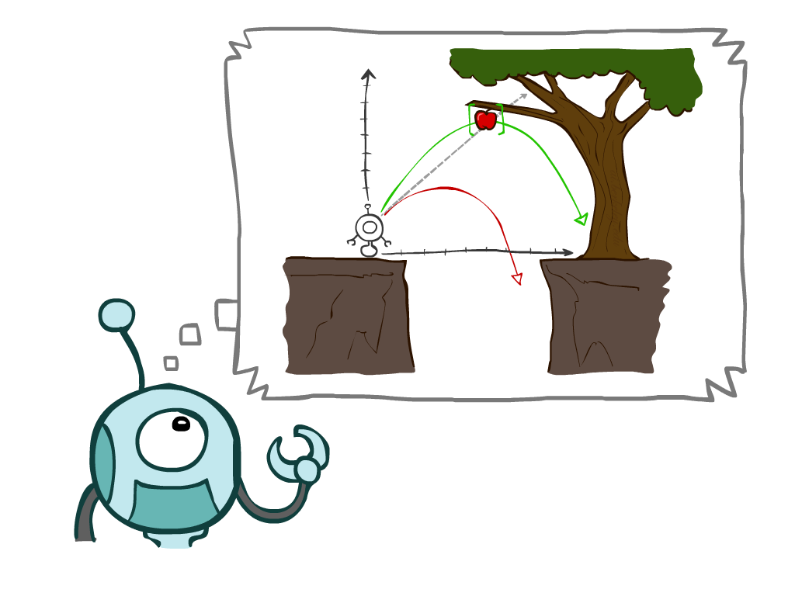

</div>

</div>

---

# Agents that Plan

<center>


</center>


---


# Reflex Agents

<div class = "two-column">

<div>

* Reflex agents:
  * Choose action based on current percept \(and maybe memory\)
  * May have memory or a model of the world’s current state
  * Do not consider the future consequences of their actions
  * <span style="color:#ff0000">Consider how the world IS</span>


* Can a reflex agent be rational?

</div>

<div>

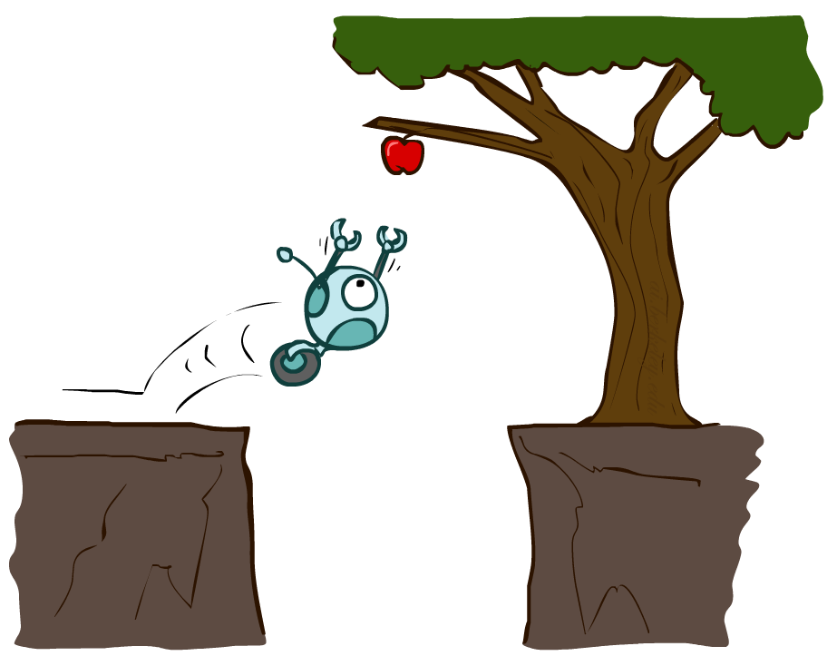

</div>

</div>

---


# Planning Agents

<div class="two-column">

<div>

* Planning agents:
  * Ask “what if”
  * Decisions based on \(hypothesized\) consequences of actions
  * Must have a model of how the world evolves in response to actions
  * Must formulate a goal \(test\)
  * <span style="color:#ff0000">Consider how the world WOULD BE</span>
* Optimal vs\. complete planning
* Planning vs\. replanning

</div>

<div>

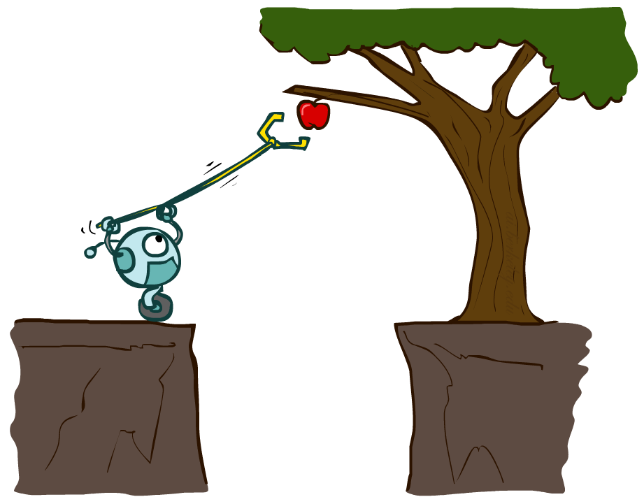

</div>

</div>

---


# Move to nearest dot and eat it

<center>


</center>

---
# Precompute optimal plan, execute it

<center>


</center>

---

<center>

# Search Problems

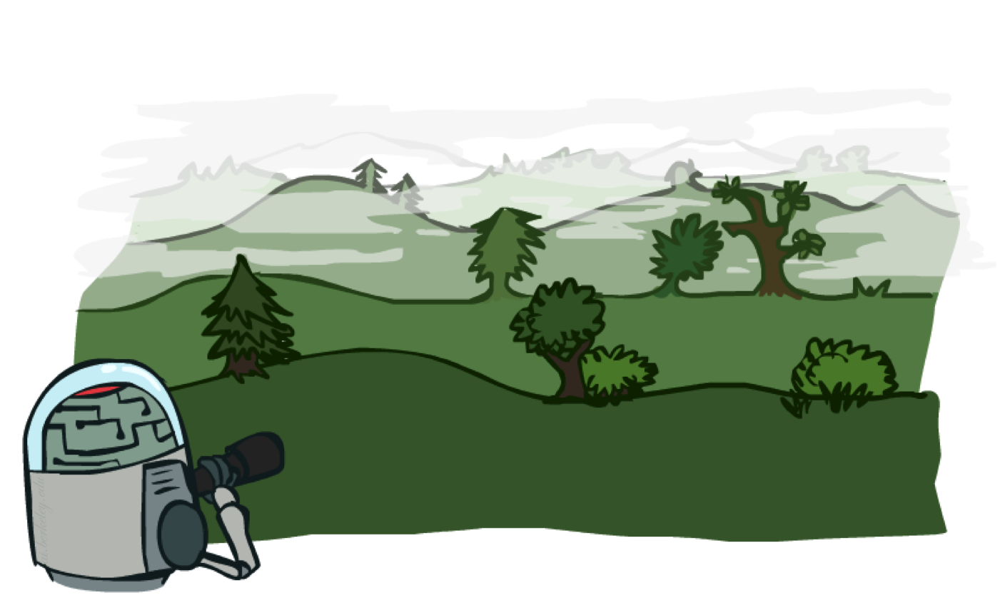

</center>

---

# Framing of Search Problem

<center>

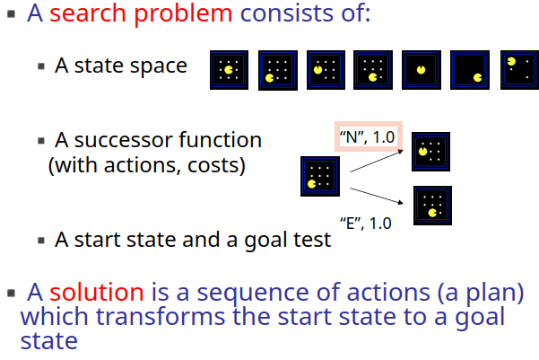

</center>

---


# Search Problems Are Models

<center>

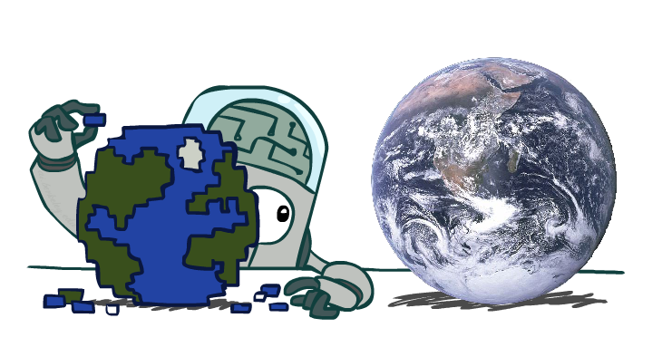

</center>

---


# Example: Traveling in Romania

<div class="two-column">

<div>

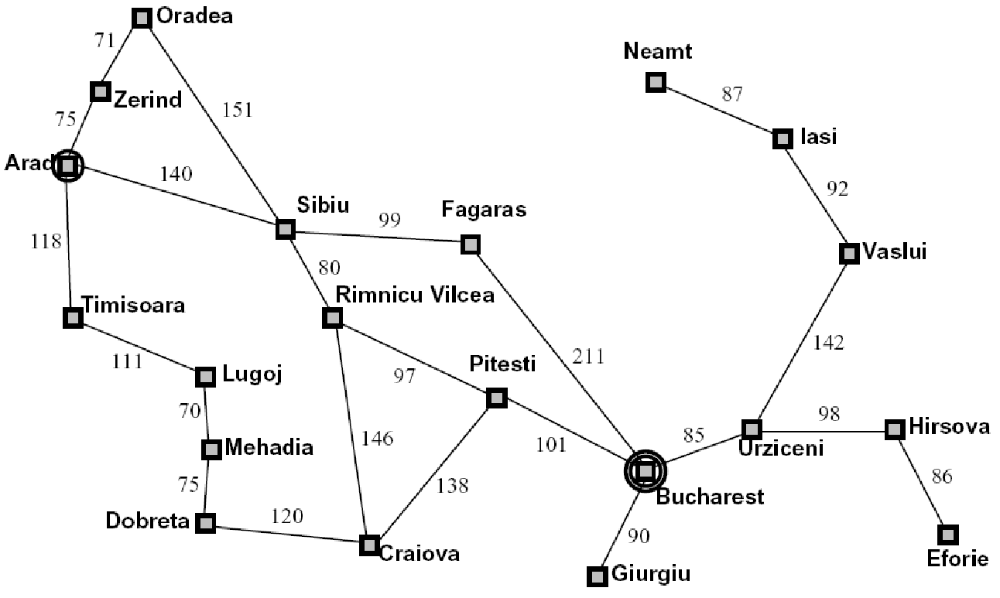

</div>

<div>

* State space:
  * Cities
* Successor function:
  * Roads: Go to adjacent city with cost = distance
* Start state:
  * Arad
* Goal test:
  * Is state == Bucharest?
* Solution?

</div>

</div>

---


# What's in a State Space?

The <span style="color:#ff0000">world state</span> includes every detail of the environment

<center>

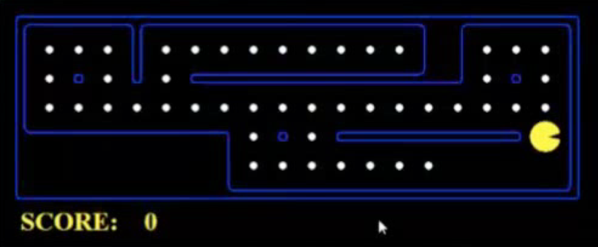

</center>

A <span style="color:#ff0000">search state</span> keeps only the details needed for planning \(abstraction\)

<div class="two-column">

<div>

<span style="color: #185c33;">Problem: Path Planning</span>
  * States: \(x\, y\) location
  * Actions: <span style="color:#ff0000">NSEW</span>
  * Successor: update location only
  * Goal test: is \(x\,y\)=END

</div>

<div>

<span style="color: #185c33;">Problem: Eat\-All\-Dots</span>
  * States: \{\(x\,y\)\, dot <span style="color:#ff0000">booleans</span>\}
  * Actions: <span style="color:#ff0000">NSEW</span>
  * Successor: update location and possibly a dot boolean
  * Goal test: dots all false

</div>

</div>

---

# State Space Sizes?

<div class = "two-column">

<div>

* World state:
  * Agent positions: <span style="color: #ff0000;">120</span>
  * Food count: <span style="color: #ff0000;">30</span>
  * Ghost positions: <span style="color: #ff0000;">12</span>
  * Agent facing: <span style="color: #ff0000;">NSE</span>
* How many
  * World states?
  * $120 \times 2^{30} \times 12^{2} \times 4$
  * States for pathing?
  * $120$
  * States for eat\-all\-dots?
  * $120 \times 2^{30}$

</div>

<div>

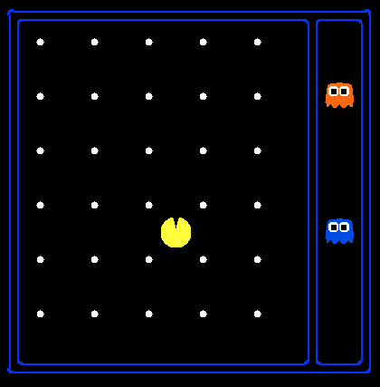

</div>

---


# Quiz: Safe Passage


<span style="color:rgb(224, 22, 83);">Problem: eat all dots while keeping the ghosts perma\-scared </span>  
<span style="color:rgb(224, 22, 83);">What does the state space have to specify?</span>   
  * agent position, dot booleans, power pellet booleans, remaining scared time

---


# State Space Graphs and Search Trees

<div class="two-column">

<div>

- Each branch is a possible choice

- Each node is a possible state

- Same state may occur in several branches

</div>

<div>


</div>

</div>

---

# State Space Graphs

<div class="two-column">

<div>

* <span style="color:#ff0000">State space graph</span>: A mathematical representation of a search problem
  * <span style="color:#ff0000">Nodes</span> are \(abstracted\) world configurations
  * <span style="color:#ff0000">Arcs</span> represent successors \(action results\)
  * The <span style="color:#ff0000">goal test</span> is a set of goal nodes \(maybe only one\)
* In a state space graph\, each state occurs only once\!

<span style="color:#ff0000">We can rarely build this full graph in memory \(it’s too big\)\, but it’s a useful idea</span>

</div>

<div>

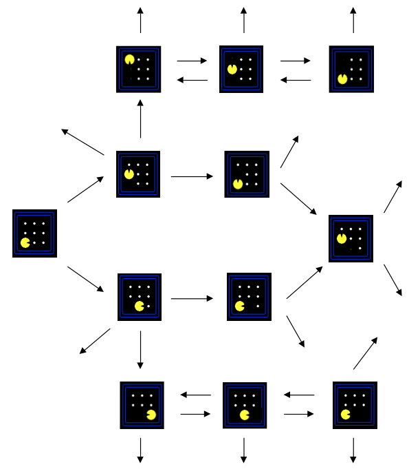

</div>

</div>

---
# An Abstract Example

<div class="two-column">

<div>

* <span style="color:#ff0000">State space graph</span>: A mathematical representation of a search problem
  * <span style="color:#ff0000">Nodes</span> are \(abstracted\) world configurations
  * <span style="color:#ff0000">Arcs</span> represent successors \(action results\)
  * The <span style="color:#ff0000">goal test</span> is a set of goal nodes \(maybe only one\)
* In a state space graph\, each state occurs only once\!

We can rarely build this full graph in memory \(it’s too big\)\, but it’s <span style="color:#ff0000">a useful idea</span>

</div>

<div>

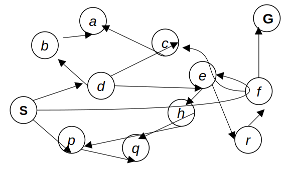

*Tiny state space graph for a tiny search problem*
</div>

</div>

---

# Search Trees

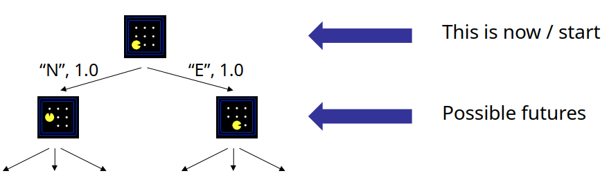

<div class="small-text">

* A search tree:
  * A <span style="color:#ff00dd">“what if”</span> tree of plans and their outcomes
  * The <span style="color:#cc0000">start state</span> is the <span style="color:#cc0000">root</span> node
  * Children correspond to successors
  * <span style="color:#cc0000">Nodes</span> show <span style="color:#cc0000">states</span>, but correspond to <span style="color:#cc0000">PLANS</span> that achieve those states
  
  </div>

  <span style="color:#cc0000">For most problems\, we can never actually build the whole tree</span>

---

# State Space Graphs vs. Search Trees

<div class="two-column">

<div>

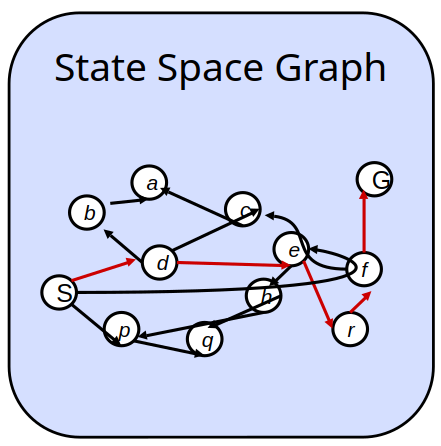

</div>

<div>

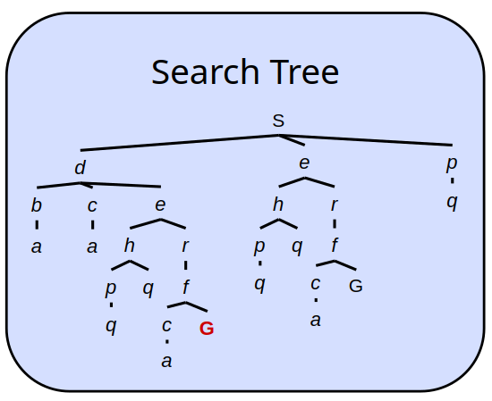

</div>

</div>

- Each NODE in in the search tree is an entire PATH in the state space graph.
- We construct graph and search on demand, and we construct as little as possible
   - lazy construction \(could use generator...\)

---
 
# State Graph Size vs Search Space Size
<div class="two-column">


<div>

## Consider this 4\-state graph.

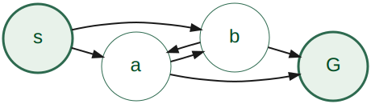

</div>

<div>

## How big is its search tree \(from S\)?

<center>


</center>

</div>

</div>

---

# Repeated Structure in Search Tree

<style scoped>
.three-column {
  display: grid;
  grid-template-columns: 1fr 1fr 1fr;
  gap: 20px;
  align-items: center;
}
</style>

<div class="three-column">

<div>

## Consider this 4\-state graph.


</div>

<div>

## First 4 levels of search tree

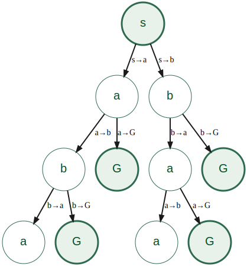

</div>

<div>

## How big is its search tree \(from S\)?

<center>


</center>

</div>

</div>

---

<center>

# Tree Search


</center>

---


# Search Example: Navigate Romania

<center>


</center>

---


# Searching with a Search Tree

<div class="two-column">

<div>

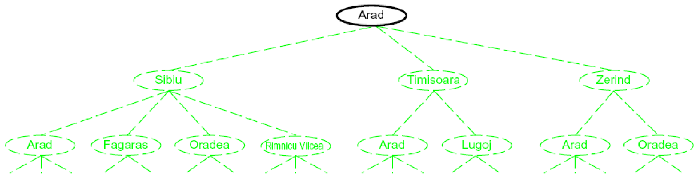

</div>

<div>


</div>

</div>

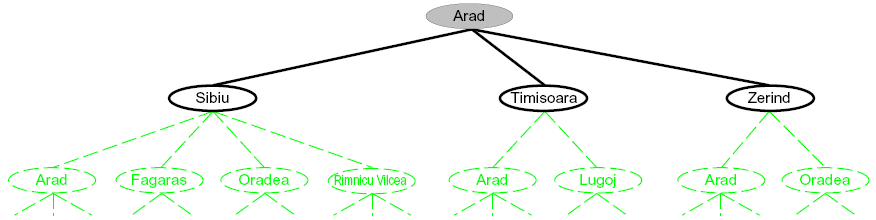


---

# Search Algorithm 

1. Expand out potential plans \(tree nodes\)
1. Maintain a  <span style="color:#cc0000">fringe </span> of partial plans under consideration
1. Try to  <span style="color:#ff0000">expand</span>  as  <span style="color:#ff0000">few</span>  tree nodes as possible

---

# General Tree Search

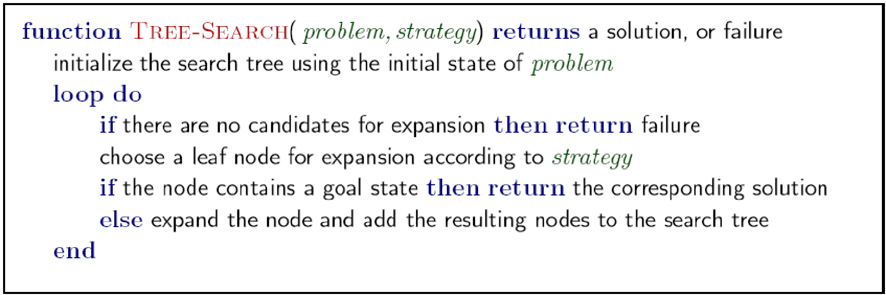


* Important ideas:
  * Fringe
  * Expansion
  * Exploration strategy
* Main question:  <span style="color:#ff0000">which</span>  fringe nodes to explore?

---

# Example: Tree Search

<center>

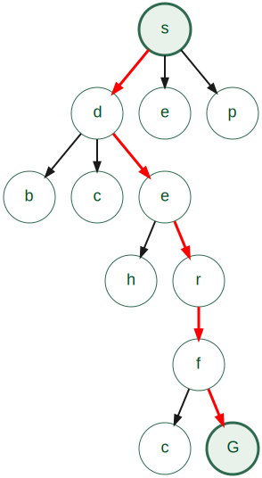

</center>


---

<center>

# Depth-First Search

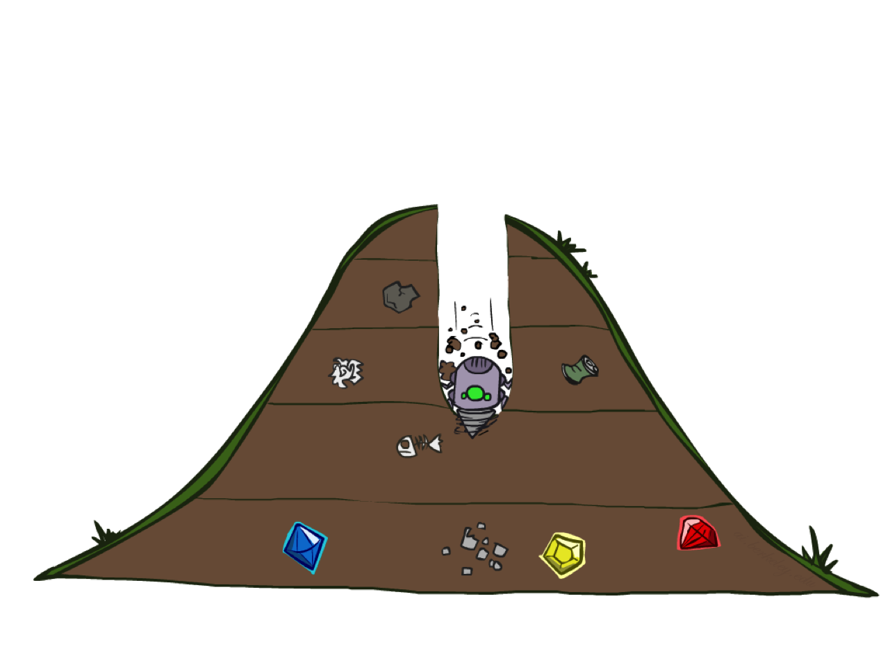

</center>

---

# DFS 

**Idea:** Full speed ahead in one direction until you can't go further

**Strategy:** expand a deepest node first

**Implementation:** Fringe is a LIFO stack

---

# Try It: DFS Water Maze Simulation

<div class="small-text">

**Run the DFS simulation:**

**Linux/Mac:**
```bash
cd code
./run_dfs_simulation.sh
```

**Windows:**
```cmd
cd code
run_dfs_simulation.bat
```

**Or manually:**
```bash
cd code/dfs_water
python3 dfs_water_maze.py
```

**Requirements:** Python 3.13+ with numpy and matplotlib

Watch water spread through the maze using DFS - it goes deep first!

</div>

---

# Search Algorithm Properties

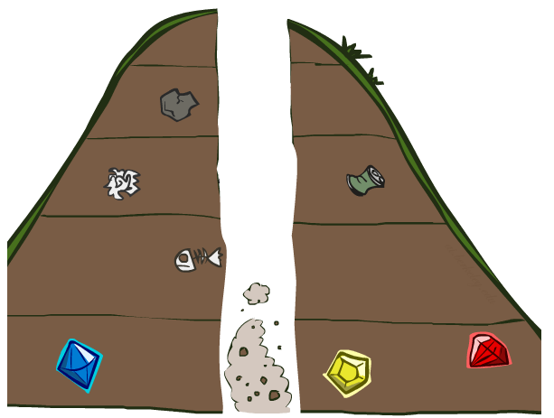

---

# Properties 

* Complete: Guaranteed to find a solution if one exists?
* Optimal: Guaranteed to find the least cost path?
* Time complexity?
* Space complexity?

<div class = "two-column">

<div>

* Cartoon of search tree:
  * b is the branching factor
  * m is the maximum depth
  * solutions at various depths s
* Number of nodes in entire tree?
  * $1 + b + b^2 + … + b^m = O(b^m)$

</div>

<div>

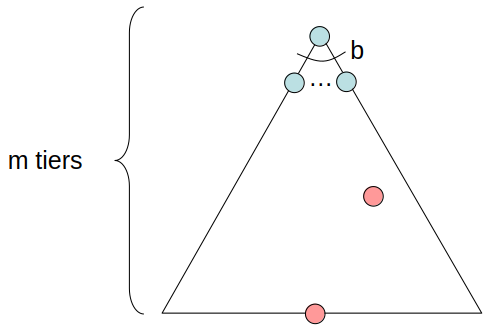
</div>

</div>

---

# Even More DFS Properties

<div class = "two-column">

<div class = "small-text">

- What nodes does DFS expand?
   - Some left prefix of the tree
   - Could process whole tree
   - If $m$ is finite, takes $O(b^m)$ time
- How much space does fringe take?
   - only has siblings on path to root
   - $O(bm)$

- Is it complete?
   - $m$ could be infinite... 
   - only if we prevent cycles

- Is it optimal?
   - No
   - Finds leftmost solution
   - Does not consider cost or depth

</div>

<div>

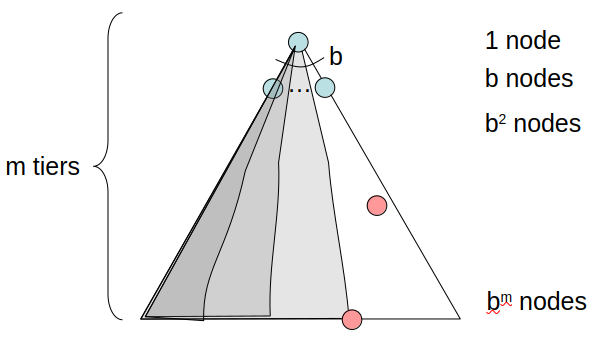

</div>

</div>

---

# Breadth-First Search (BFS)

<div class = "two-column">

<div>


**Strategy:** expand a <span style="color:#ff0000">shallowest node</span> <span style="color: dark green">first</span>

**Implementation:** Fringe is a FIFO queue
</div>

<div>

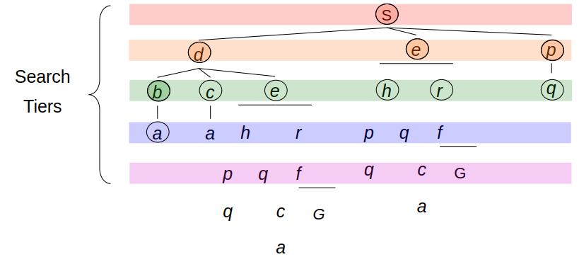

</div>

</div>

---

# Try It: BFS Water Maze Simulation

<div class="small-text">

**Run the BFS simulation:**

**Linux/Mac:**
```bash
cd code
./run_bfs_simulation.sh
```

**Windows:**
```cmd
cd code
run_bfs_simulation.bat
```

**Or manually:**
```bash
cd code/bfs_water
python3 bfs_water_maze.py
```

**Requirements:** Python 3.13+ with numpy and matplotlib

Watch water spread level by level using BFS - notice the difference from DFS!

</div>

---

# BFS Properties

<div class="two-column">

<div class= "small-text">

- What nodes does BFS expand?
   - processes all nodes above the shallowest solution $s$
   - search time is $O(b^s)$

- How much space does fringe take?
  - $O(b^s)$

- Is it complete?
   - If solution exists, $s$ must be finite
   - So yes

- Is it optimal?
   - only if all costs are 1 (or equal)

</div>

<div>

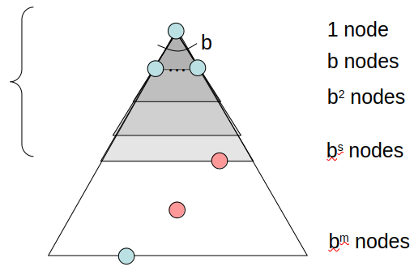

</div>

</div>

---

# DFS vs BFS

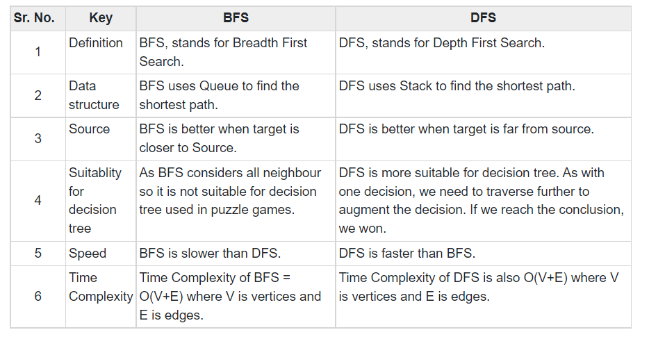

---

# Quiz: DFS vs BFS

1. When will BFS outperform DFS?

1. When will DFS outperform BFS?

---


# Example: Maze Water with BFS


- BFS spreads out in concentric circles from root.
- Explores a lot of the state space

---

# Example: Maze Water with DFS

- Explores less but finds a terrible solution.
- It is checking for repeated states
   - Otherwise it would never complete


---


# Iterative Deepening

<div class="two-column">

<div>

* Idea: get DFS’s space advantage with BFS’s time / shallow\-solution advantages
  * Run a DFS with depth limit 1\.  If no solution…
  * Run a DFS with depth limit 2\.  If no solution…
  * Run a DFS with depth limit 3\.  …\.\.
* Isn’t that wastefully redundant?
  * Generally most work happens in the lowest level searched\, so not so bad\!

</div>

<div>

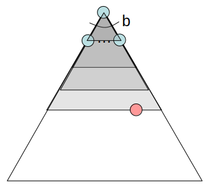

</div>

---

# Cost-Sensitive Search

<center>
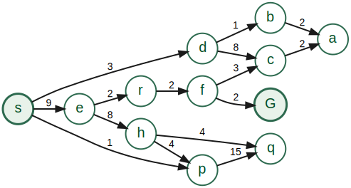
</center>

BFS finds the shortest path in terms of number of actions.

It does not find the least\-cost path\.  We will now cover

a similar algorithm which does find the least\-cost path\.

---

<center>

# Uniform Cost Search (UCS)

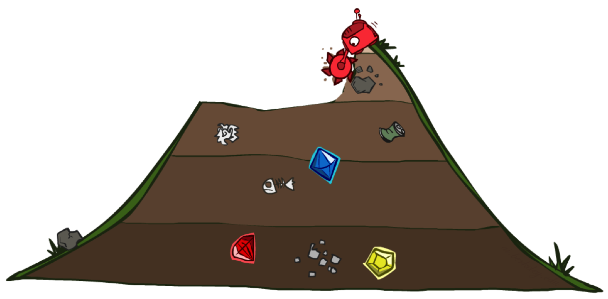

</center>

---
# UCS Profile


Strategy: expand a cheapest node first

Fringe is a priority queue \(priority: cumulative cost\)

---

# Example Cost profile 

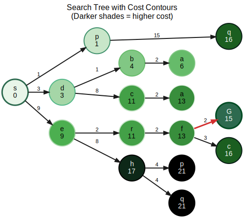

---

# Uniform Cost Search (UCS) Properties

<div class="two-column">

<div>

* What nodes does UCS expand?
  * All nodes with cost less than cheapest solution
  * Let solution cost = $C^*$
  * Let arcs cost $\geq \varepsilon$
  * “effective depth” $\approx C^*/\varepsilon$
  * Takes time $O(b^{C^*/\varepsilon})$
* How much space does the fringe take?
  * $O(b^{C^*/\varepsilon})$
* Is it complete?
  *Yes if: best solution has a finite cost and minimum arc cost is positive
* Is it optimal?
  * Yes\!  Proof via $A^*$
</div>

<div>

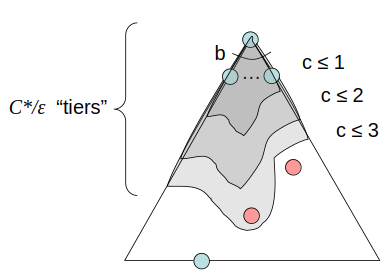
</div>

</div>

---

# Uniform Cost Issues

<div class = "two-column">

<div>

* UCS explores increasing cost contours
* The good: UCS is complete and optimal\!
* The bad:
  * Explores options in every “direction”
  * No information about goal location

We’ll fix the bad soon\!

</div>

<div>


</div>

</div>

---

# Guess Which One --- BFS or UCS?

<div class="small-text">

**Run the simulation:**

**Linux/Mac:**
```bash
cd code
./run_guess_simulation.sh
```

**Windows:**
```cmd
cd code
run_guess_simulation.bat
```

**Or manually:**
```bash
cd code/guess_bfs_ucs
python3 guess_bfs_water_maze.py
```

**Requirements:** Python 3.13+ with numpy and matplotlib

**The maze has:**
- Shallow water (cost 1) - light blue background
- Deep water (cost 2) - dark blue background

</div>

---

# Guess Which of the Three --- DFS, BFS, UCS

<div class="small-text">

**Run the simulation:**

**Linux/Mac:**
```bash
cd code
./run_guess_ucs_simulation.sh
```

**Windows:**
```cmd
cd code
run_guess_ucs_simulation.bat
```

**Or manually:**
```bash
cd code/guess_bfs_ucs
python3 guess_ucs_water_maze.py
```

**Requirements:** Python 3.13+ with numpy and matplotlib

**The maze has:**
- Shallow water (cost 1) - light blue background
- Deep water (cost 2) - dark blue background

</div>

---


# The One Queue

<div class = "two-column">

<div>

* All search algorithms same except different fringe strategies
* All fringes are priority queues: collections of nodes with attached priorities
* For DFS and BFS, you can avoid the $log(n)$ overhead from an actual priority queue by using stack or queue

* Can create one implementation that takes a variable queuing object (Stack is a LIFO Queue...)
* but don't do that for this class

 </div> 

<div>


</div>

</div>

---

# Search and Models

<div class = "two-column">


<div>

* Search operates over models of the world
* The agent doesn’t actually try all the plans out in the real world\!
* Planning is all "in simulation"
* Your search is only as good as your models…

</div>

<div>


</div>

</div>

---


# State Space Example

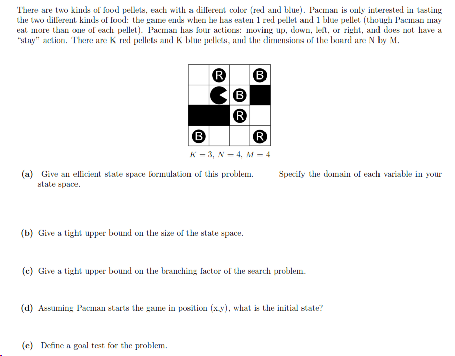


---


# State Space Example (Solution)

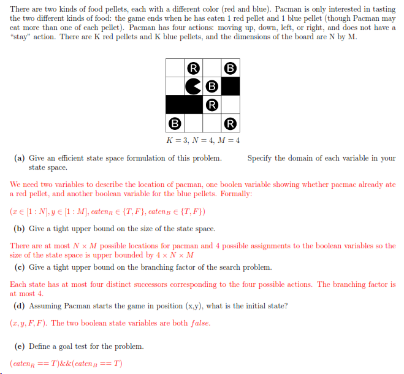


---


# Search Problem Example

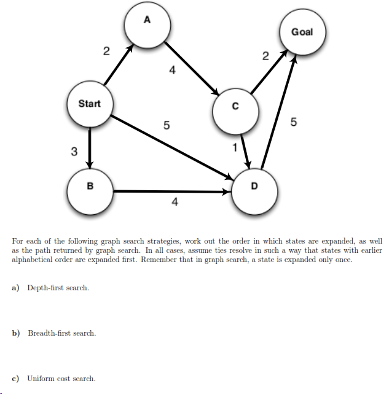


---


# Search Problem Example (solution)

<div class = "two-column">

<div>

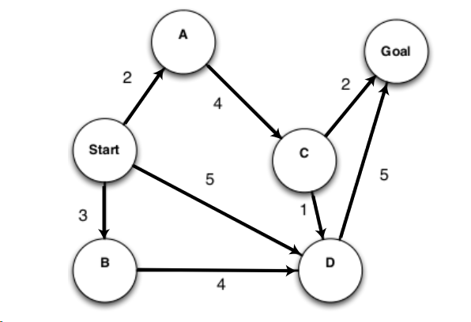

</div>

<div>

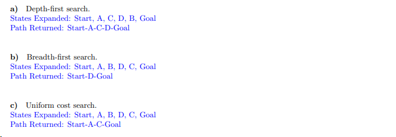

</div>

</div>

