

# CS 6460: Artificial Intelligence
## Informed Search

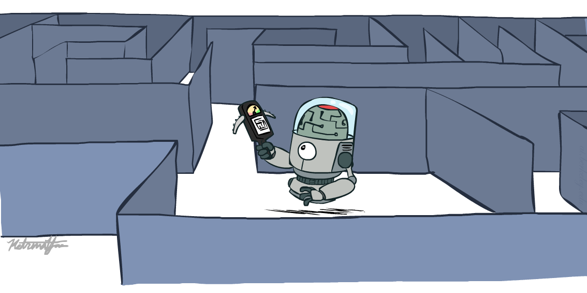

Instructor: George Rudolph
Utah Valley University Spring 2025

[These slides adapted from Dan Klein and Pieter Abbeel at UC Berkley]

---
# Learning Outcomes

1. Solve Problems using Informed Searches
- Heuristics
- Greedy Search
- A* Search
2. Model Problems as Graph Search

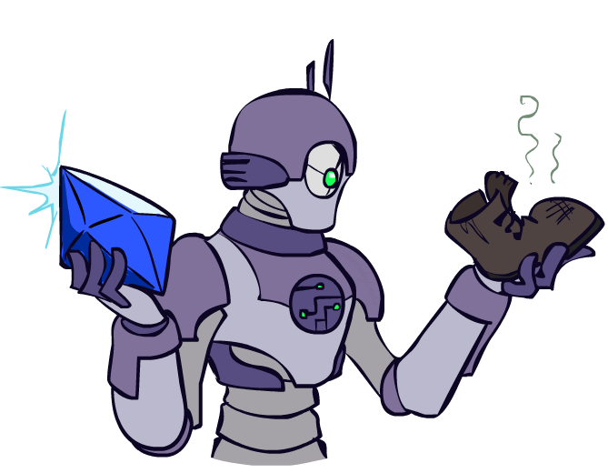

---

# Search and Models

- Search operates over models of the world
- The agent doesn’t actually try all the plans out in the real world!
- Planning is all in simulation
- Your search is only as good as your models…

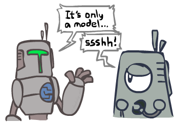

---

# Informed Search

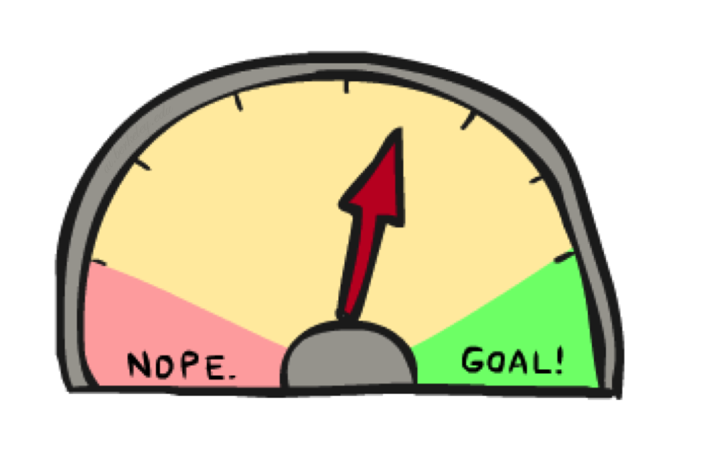

---
# Search Heuristics

A heuristic is:
- A function that estimates how close a state is to a goal
- Designed for a particular search problem
- Examples: Manhattan distance, Euclidean distance

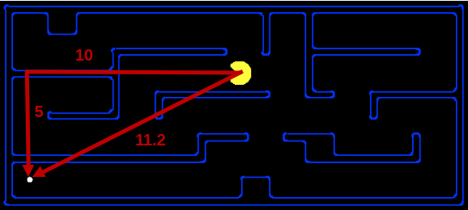

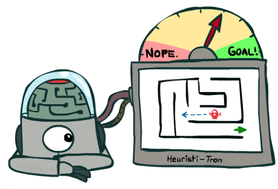

---

# Example: Heuristic Function

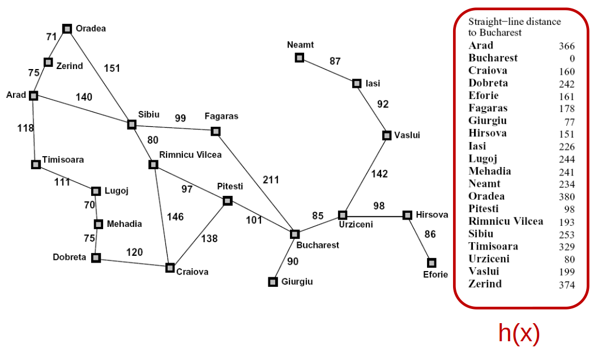

---

# Greedy Search

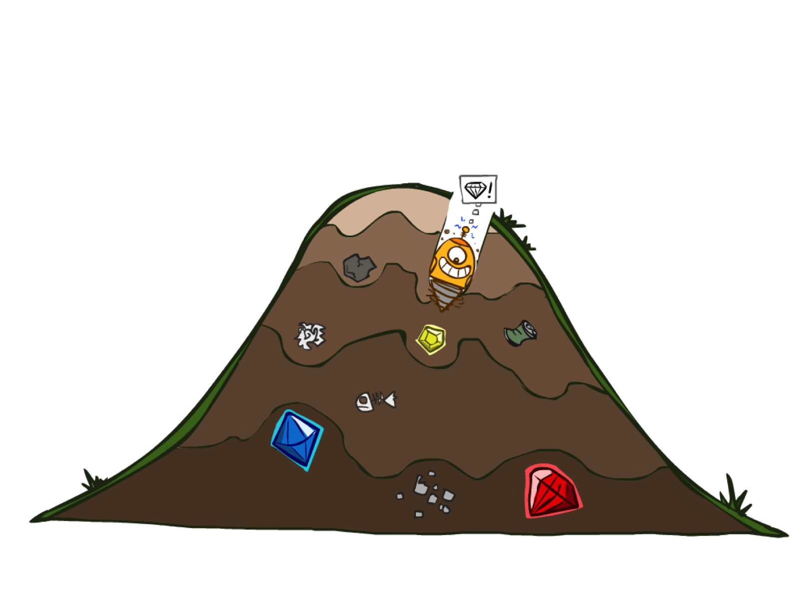

---
# Example: Greedy Heuristic Function

---
# Greedy Search

- Expand the node that seems closest…
- What can go wrong?

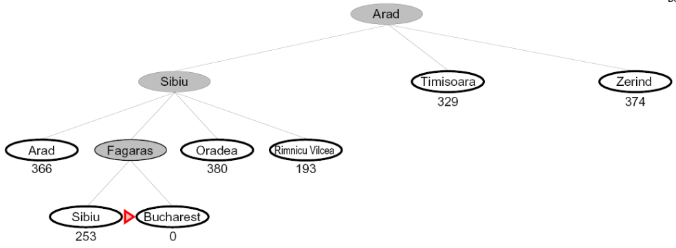

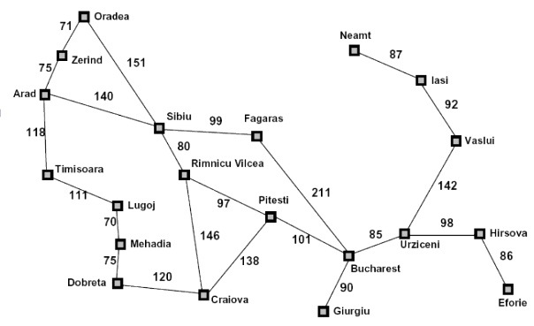

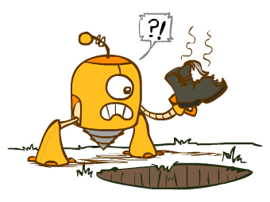

---

# Greedy Search

- Strategy: expand a node that you think is closest to a goal state
   - Heuristic: estimate of distance to nearest goal for each state

A common case
- Best-first takes you straight to the (wrong) goal

Worst-case  
- behaves like a badly-guided DFS

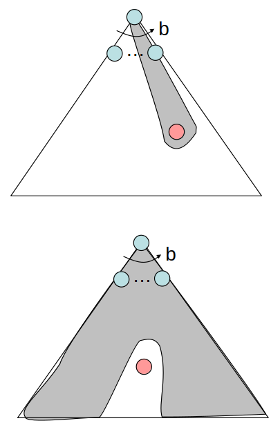

---
# Video of Demo Contours Greedy (Empty)
---
# Video of Demo Contours Greedy (Pacman Small Maze)
---

# A* Search

---

# A* Search

<strong>UCS</strong> 

<strong>Greedy</strong> 

<strong>A*</strong> 

---
# Combining UCS and Greedy
- Uniform-cost orders by path cost, or backward cost  g(n)
- Greedy orders by goal proximity, or forward cost  h(n)
- A* Search orders by the sum: f(n) = g(n) + h(n)
- S
- a
- d
- b
- G
- h=5
- h=6
- h=2
- 1
- 8
- 1
- 1
- 2
- h=6
- h=0
- c
- h=7
- 3
- e
- h=1
- 1
- Example: Teg Grenager
- S
- a
- b
- c
- e
- d
- d
- G
- G
- g = 0 h=6
- g = 1 h=5
- g = 2 h=6
- g = 3 h=7
- g = 4 h=2
- g = 6 h=0
- g = 9 h=1
- g = 10 h=2
- g = 12 h=0

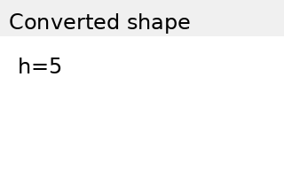

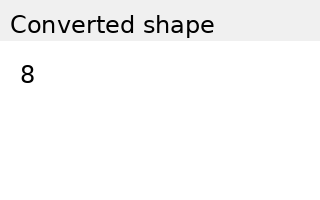

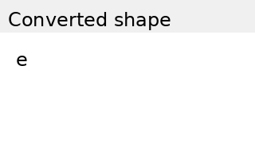

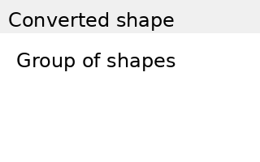
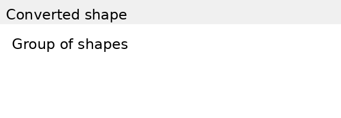

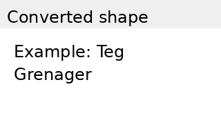
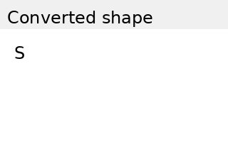
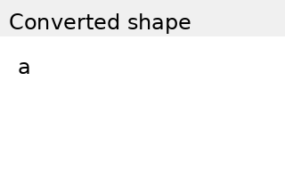

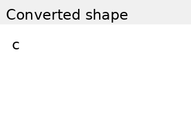

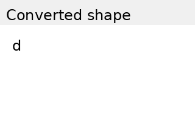

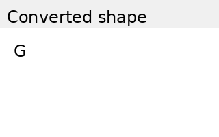

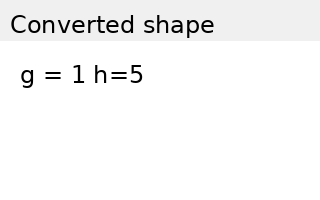
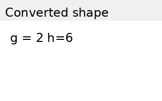

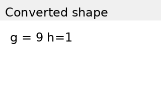
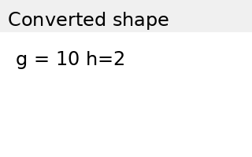
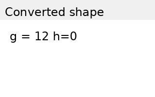
---
# When should A* terminate?
- Should we stop when we put a goal in the fringe?
- No: only stop when we pull a goal off the fringe
- S
- B
- A
- G
- 2
- 3
- 2
- 2
- h = 1
- h = 2
- h = 0
- h = 3

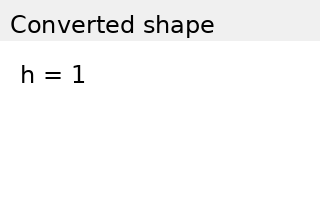

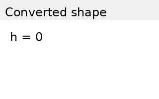

---
# Is A* Optimal?
- What is wrong?
- Actual bad goal cost < estimated good goal cost
- We need estimates to be less than actual costs!
- A
- G
- S
- 1
- 3
- h = 6
- h = 0
- 5
- h = 7

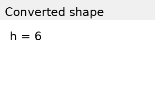

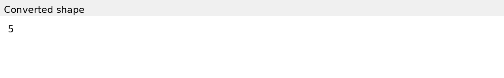
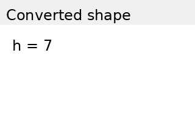
---
# Admissible Heuristics

---
# Idea: Admissibility
- Inadmissible (pessimistic) heuristics break optimality by trapping good plans on the fringe
- Admissible (optimistic) heuristics slow down bad plans but never outweigh true costs
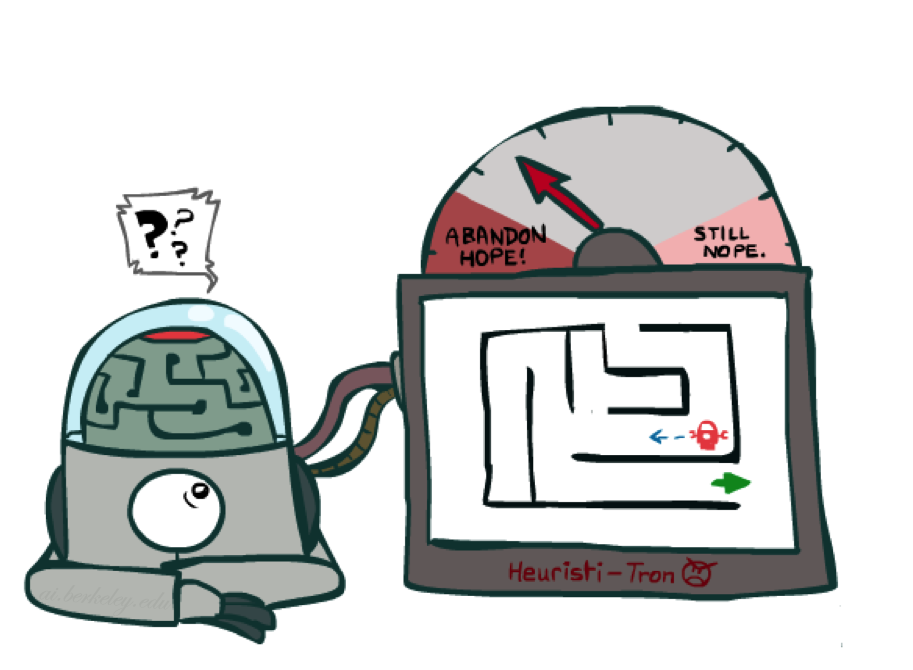
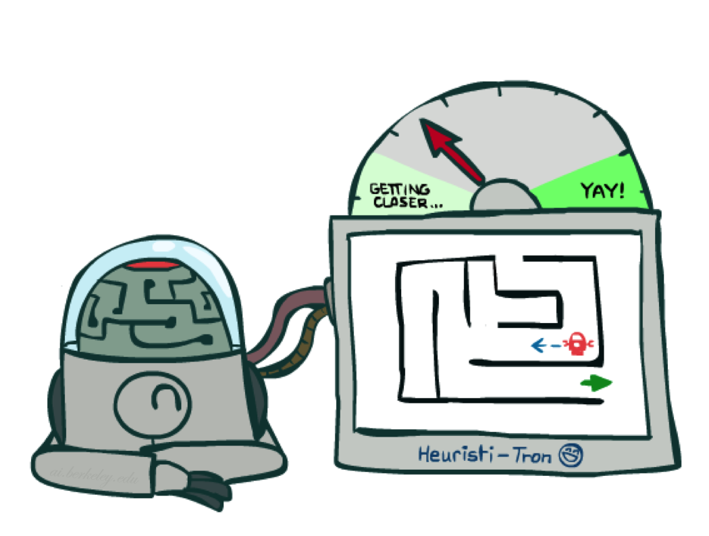
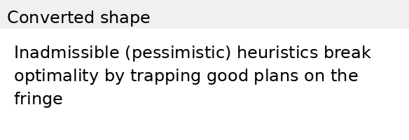
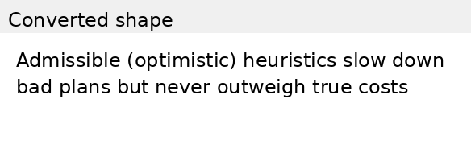
---
# Admissible Heuristics
- A heuristic h is admissible (optimistic) if:
- where               is the true cost to a nearest goal
- Examples:
- Defining admissible heuristics is the biggest effort in using A* in practice

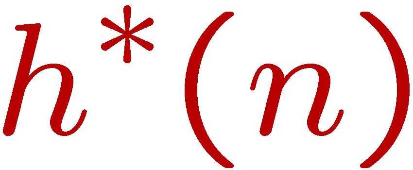

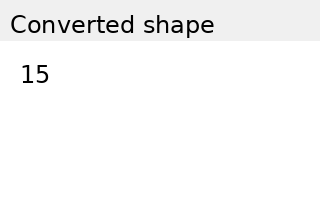
---
# Optimality of A* Tree Search

---
# Optimality of A* Tree Search
- Assume:
- A is an optimal goal node
- B is a suboptimal goal node
- h is admissible
- Claim:
- A will exit the fringe before B
- …

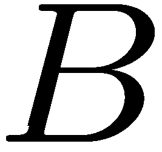

---
# Optimality of A* Tree Search: Blocking
- Proof:
- Imagine B is on the fringe
- Some ancestor n of A is on the fringe, too (maybe A!)
- Claim: n will be expanded before B
- f(n) is less or equal to f(A)
- Definition of f-cost
- Admissibility of h
- …
- h = 0 at a goal
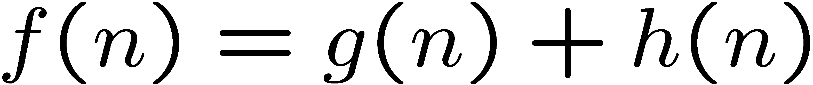
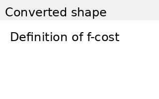
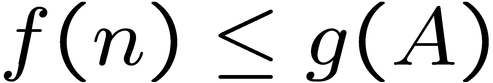
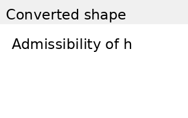

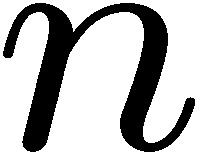

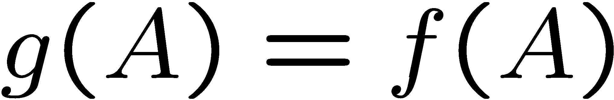

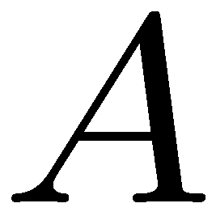
---
# Optimality of A* Tree Search: Blocking
- Proof:
- Imagine B is on the fringe
- Some ancestor n of A is on the fringe, too (maybe A!)
- Claim: n will be expanded before B
- f(n) is less or equal to f(A)
- f(A) is less than f(B)
- B is suboptimal
- h = 0 at a goal
- …

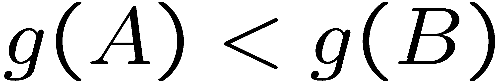
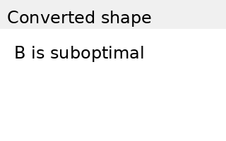
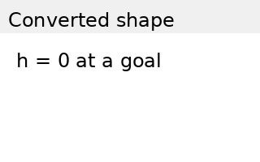

---
# Optimality of A* Tree Search: Blocking
- Proof:
- Imagine B is on the fringe
- Some ancestor n of A is on the fringe, too (maybe A!)
- Claim: n will be expanded before B
- f(n) is less or equal to f(A)
- f(A) is less than f(B)
- n expands before B
- All ancestors of A expand before B
- A expands before B
- A* search is optimal
- …

---
# Properties of A*
---
# Properties of A*
- …
- b
- …
- b
- Uniform-Cost
- A*

---
# UCS vs A* Contours
- Uniform-cost expands equally in all “directions”
- A* expands mainly toward the goal, but does hedge its bets to ensure optimality
- Start
- Goal
- Start
- Goal

---
# Video of Demo Contours (Empty) -- UCS
---
# Video of Demo Contours (Empty) -- Greedy
---
# Video of Demo Contours (Empty) – A*
---
# Video of Demo Contours (Pacman Small Maze) – A*
---
# Comparison
- Greedy
- Uniform Cost
- A*

---
# A* Applications

---
# A* Applications
- Video games
- Path / routing problems
- Resource planning problems
- Robot motion planning
- Language analysis
- …

---
# Video of Demo Pacman (Tiny Maze) – UCS / A*
---
# Video of Demo Empty Water Shallow/Deep – Guess Algorithm
---
# Creating Heuristics

---
# Creating Admissible Heuristics
- Most of the work in solving hard search problems optimally is in coming up with admissible heuristics
- Often, admissible heuristics are solutions to relaxed problems, where new actions are available
- Inadmissible heuristics are often useful too
- 366

---
# Example: 8 Puzzle
- What are the states?
- How many states?
- What are the actions?
- How many successors from the start state?
- What should the costs be?
- Start State
- Goal State
- Actions

---
# 8 Puzzle I
- Heuristic: Number of tiles misplaced
- Why is it admissible?
- h(start) =
- This is a relaxed-problem heuristic
- 8
- Statistics from Andrew Moore

---
# 8 Puzzle II
- What if we had an easier 8-puzzle where any tile could slide any direction at any time, ignoring other tiles?
- Total Manhattan distance
- Why is it admissible?
- h(start) =
- 3 + 1 + 2 + … = 18

---
# 8 Puzzle III
- How about using the actual cost as a heuristic?
- Would it be admissible?
- Would we save on nodes expanded?
- What’s wrong with it?
- With A*: a trade-off between quality of estimate and work per node
- As heuristics get closer to the true cost, you will expand fewer nodes but usually do more work per node to compute the heuristic itself

---
# Semi-Lattice of Heuristics
---
# Trivial Heuristics, Dominance
- Dominance: ha ≥ hc if
- Heuristics form a semi-lattice:
- Max of admissible heuristics is admissible
- Trivial heuristics
- Bottom of lattice is the zero heuristic (what does this give us?)
- Top of lattice is the exact heuristic

---
# Graph Search

---
# Tree Search: Extra Work!
- Failure to detect repeated states can cause exponentially more work.
- Search Tree
- State Graph

---
# BFS Graph Search Example
- we shouldn’t bother expanding the circled nodes: WHY?

---
# Graph Search
- Idea: never expand a state twice
- How to implement:
- Tree search + set of expanded states (“closed set”)
- Expand the search tree node-by-node, but…
- Before expanding a node, check to make sure its state has never been expanded before
- If not new, skip it, if new add to closed set
- Important: store the closed set as a set, not a list
- Can graph search wreck completeness?  Why/why not?
- How about optimality?
---
# A* Graph Search Gone Wrong?
- S
- A
- B
- C
- G
- 1
- 1
- 1
- 2
- 3
- S (0+2)
- State space graph
- Search tree

---
# Consistency of Heuristics
- Main idea: estimated heuristic costs ≤ actual costs
- Admissibility: heuristic cost ≤ actual cost to goal
- h(A) ≤ actual cost from A to G
- Consistency: heuristic “arc” cost ≤ actual cost for each arc
- h(A) – h(C) ≤ cost(A to C)
- Consequences of consistency:
- The f value along a path never decreases
- h(A) ≤ cost(A to C) + h(C)
- A* graph search is optimal
- 3
- A
- C
- G
- h=4
- h=1
- 1
- h=2

---
# Optimality
- Tree search:
- A* is optimal if heuristic is admissible
- UCS is a special case (h = 0)
- Graph search:
- A* optimal if heuristic is consistent
- UCS optimal (h = 0 is consistent)
- Consistency implies admissibility
- In general, most natural admissible heuristics tend to be consistent, especially if from relaxed problems

---
# A*: Summary
- A* uses both backward costs and (estimates of) forward costs
- A* is optimal with admissible / consistent heuristics
- Heuristic design is key: often use relaxed problems

---
# Tree Search Pseudo-Code

---
# Graph Search Pseudo-Code

---
# Search Problem Example 1

---
# Search Problem Example 1 (solution)

